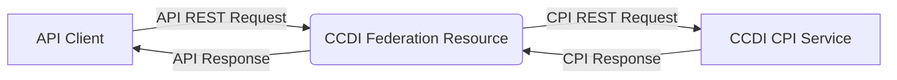

<ClientOnly>

Expanding the CCDI Federation API: subject-mapping Endpoint

The CCDI Federation Resource API Team

July 23, 2025

We’re excited to announce a major update to the [CCDI Federation API][ResourceAPI-main]: the new `/subject-mapping` endpoint available within [the Federation Resource API][spec-aggr] that links Federation member participants with the [CCDI Participant Index (CPI)][CPI-main] to help researchers connect participant data across multiple pediatric cancer studies. This enhancement makes it easier to discover and analyze data from different sources, accelerating progress in childhood cancer research.

## What’s New? {#new-subject-mapping}

The `/subject-mapping` endpoint allows researchers to connect participant data across multiple studies and institutions. The CPI’s goal is to manage and share multiple cross-linked participant IDs that represent the same individual by connecting various participant IDs from different studies/research institutions (domains). By leveraging the CPI, this feature maps various participant IDs - assigned by different Federation members- to the same individual, making it easier to find and analyze related data across datasets.

## How It Works {how-it-works}

This new `/subject-mapping` endpoint is embedded in the existing search parameters used in the subject search in the Federation API. Through the `/subject-mapping` endpoint, the CPI finds the subjects known by the Federation and returns domain ID/ID pairs and all mapped organizational domain ID/ID pairs for each found subject ID.

When you conduct a subject search, the API searches the CPI, leveraging the CPI functionality [getAssociatedParticipantIds][getAssociatedParticipantIds] for all known participant IDs and organizational domains that correspond to the same individual. The response includes all mapped identifiers, helping you quickly connect related data across the Federation.

By mappings these identifiers, CPI enables researchers to connect data associated with the same individual across different datasets. This mapping capability enhances the discovery of multimodal data, facilitating the exploration of complex research questions, and ultimately supporting the development of innovative therapies for pediatric cancers.

Additional information related to the CPI can be found in the [CPI Participant index Documentation Site][CPI-spec].  

You can query this API endpoint live and get responses back — we hope you'll try it out!

<ApiCallBlockAggr
  description="Submit REST API request to map the first eight subjects participants IDs known about by each source server where sex is F."
  method="GET"
  path="/subject-mapping?per_page=8&sex=F"
/>

### CPI Response Data Table {#cpi-response-data}

<DataTable :endpoint="'https://federation.ccdi.cancer.gov/api/v1/subject-mapping?per_page=6&sex=F'"/>

<ApiCallBlockAggr
  description="Submit REST API request to map subject participants IDs where ID is SJ000008."
  method="GET"
  path="/subject-mapping?identifiers=SJ000008"
/>

### CPI Response Data Table {#cpi-response-data-1}

<DataTable :endpoint="'https://federation.ccdi.cancer.gov/api/v1/subject-mapping?identifiers=SJ000008'"/>

## Learn More
For technical details on the CPI service, please visit the [CPI Participant Index Documentation Site][CPI-spec].

To stay updated on our progress, please star and follow the project [on GitHub](https://github.com/cbiit/ccdi-federation-api).

[ccdi-main]: https://www.cancer.gov/research/areas/childhood/childhood-cancer-data-initiative
[spec]: https://cbiit.github.io/ccdi-federation-api/specification.html
[spec-aggr]: https://cbiit.github.io/ccdi-federation-api-aggregation
[Kids First DRC]: https://kidsfirstdrc.org/
[St. Jude Cloud]: https://stjude.cloud
[Pediatric Cancer Data Commons]: https://commons.cri.uchicago.edu/pcdc/
[Treehouse Childhood Cancer Initiative]: https://treehousegenomics.ucsc.edu/
[Childhood Cancer Catalog of ecDNA CCDI API server]: https://ccdi-ecdna.org/
[CPI-main]: https://ccdi.cancer.gov/ccdi-participant-index
[ResourceAPI-main]: https://ccdi.cancer.gov/data-federation-resource
[getAssociatedParticipantIds]: https://participantindex-docs.ccdi.cancer.gov/#operation/getAssociatedParticipantIds
[CPI-spec]: https://participantindex-docs.ccdi.cancer.gov/
</ClientOnly>
