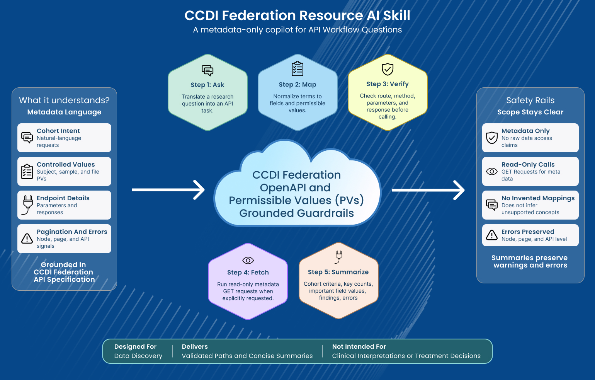
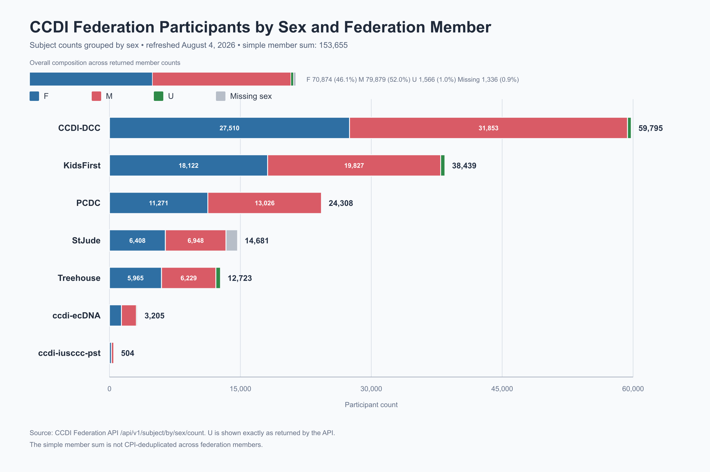

<ClientOnly>

Introducing the CCDI Data Federation Agent Skill

 

The CCDI Federation Resource Team

August 27, 2026

The Childhood Cancer Data Initiative ([CCDI][CCDI]) is pleased to announce a new
Agent Skill ([CCDI Federation AI][CCDI Federation AI]) designed
to help users plan, validate, explain, and execute metadata-only queries
using the [CCDI Federation Resource][CCDI Federation Resource]. The skill
streamlines the discovery and analysis of metadata from diverse sources,
helping accelerate childhood cancer research.

  

The CCDI Data Federation unifies metadata from multiple pediatric cancer
resources, enabling researchers to identify subjects, samples, and files
across participating nodes. While the federation is powerful, it
presents a challenge: researchers often use plain-language research
terms, whereas APIs require specific endpoints, parameters, field names,
and controlled values. The CCDI Data Federation Agent Skill addresses
this gap.

## The Role of the Agent Skill

An Agent Skill is a text file in markdown format (SKILL.md file) that
contains structured instructions, context, and examples so AI agents can
perform specialized tasks efficiently. The Agent Skill serves as a
metadata-aware copilot for the CCDI Federation API. Its purpose is not
to retrieve raw research data, but to assist users in planning,
validating, explaining, and optionally executing metadata-only API
queries. At a high level, the Agent Skill supports two primary
workflows: API explanation and cohort query planning.

- **API Explanation:** The skill can describe how Federation endpoints
  work, what parameters are available, what response fields mean, how
  pagination behaves, and how harmonized and unharmonized metadata
  differ. This makes the skill valuable for both running queries and
  onboarding new users to the Federation API.

- **Cohort Query Planning:** Users can describe cohorts in natural
  language, and the skill translates those descriptions into API-ready
  plans. For instance, a researcher might request tumor samples with RNA
  sequencing data or female subjects with relapsed disease. The skill
  identifies the relevant entity (subject, sample, or file), then maps
  user-friendly terms to CCDI metadata fields and permissible values as
  defined by the [API specification][API specification].

Skills are portable. Once created, a skill can be adapted for AI coding
and agent platforms, including Claude Code, OpenAI ChatGPT, Gemini
CLI, and others. Although the first version of the CCDI Data Federation
Agent Skill was developed and tested with OpenAI ChatGPT, users can load
the skill file in other supported AI platforms.

One of the most valuable aspects of the Agent Skill is semantic
permissible-value mapping. Researchers may ask for \"female subjects,\"
\"relapsed disease,\" \"variant files,\" or \"RNA sequencing.\" The API,
however, expects precise field names and exact permissible values as
defined by the API specification.

This reduces errors from spelling differences, informal phrasing, or
unsupported values. When a term is ambiguous, the skill presents
alternatives rather than guessing, such as mapping \"glioma\" to
multiple diagnosis categories depending on context.

## Running Live Metadata Requests

By default, the Agent Skill focuses on planning and explanation. It executes live API calls only when explicitly directed by the user with instructions to fetch, run, test, retrieve, inspect, or summarize live metadata. This distinction is intentional. The skill is limited to metadata-only read requests, assisting users in discovering what data exists across federation nodes, but it does not access raw genomic, clinical, imaging, or other controlled research data.

A good interaction begins with a plain-language research question, such
as:

"**What is the distribution by sex for registered participants by
Federation member?"**

Before proposing or executing a query, the skill checks the route and parameters against the CCDI Federation Open API definition, preventing unsupported filters and incorrect endpoint behavior. When controlled values are involved, it verifies bundled permissible-value metadata for subject, sample, and file entities. The output is a query plan detailing the endpoint, method, filters, pagination settings, assumptions, and any ambiguities.

Upon such requests, the skill uses validated read-only API calls, applies pagination limits, and provides summarized metadata rather than the full raw response. It also retains node-level, page-level, and API-level errors, enabling users to distinguish between empty results, partial federation responses, and actual API issues.

**Create a chart**

The resulting data can also be summarized in a presentation-quality
chart that can be exported for slides or reports.

  

## Try It Out!

The GitHub repository ([CCDI Federation AI][CCDI Federation AI]) 
provides the Agent Skill and corresponding documentation to
begin to load and run the Agent Skill. The following set of questions
includes some of the types of questions that the Agent Skill can provide
answers to. It is not meant to be an exhaustive list but rather is
illustrative of the types of analysis that can be performed to help
navigate the CCDI Data Federation and begin to utilize the Agent Skill.

| Category | Sample Question(s) |
|---|---|
| Live metadata Retrieval | ▪ How many participants are in the CCDI Data Federation by participating member?   ▪ How are the participants distributed by sex?   ▪ What is the racial distribution by subjects?   ▪ Fetch the first 10 matching sample metadata records for tumor samples with RNA-Seq data and summarize the results.   ▪ Which tissue or genomic samples are available across the CCDI Federation from patients with a confirmed diagnosis of 'Medulloblastoma' |
| Explanation | ▪ Explain the difference between harmonized and unharmonized metadata in the CCDI Federation |
| Endpoint Help | ▪ Explain what the subject endpoint returns, including supported parameters and pagination |
| Planning | ▪ Plan a CCDI Federation metadata query for tumor samples with RNA-Seq data |
| Validation | ▪ Check whether this filter is valid for the sample endpoint: library_strategy = RNA sequencing |

## Best Practices

- **Use the skill as a planning partner before running queries.** Begin
  with a natural-language cohort description, then review the mapped
  fields and permissible values before fetching results.

- **Be explicit when requesting live API execution.** Terms such as
  \"run,\" \"fetch,\" \"retrieve,\" or \"summarize live results\" signal
  the skill to move beyond planning.

- **Expect summaries, not raw dumps.** The skill is designed to provide
  readable metadata summaries that outline endpoints used, parameters
  applied, records returned, assumptions, and errors.

- **Treat ambiguities as useful signals.** If a disease term, sample
  type, or file type can map to multiple controlled values, the skill
  should display the options so the query can be refined.

## The Bottom Line

The CCDI Data Federation Agent Skill bridges the gap between research
intent and API precision. Users can start with natural language, have
their requests validated against documented API routes and supported
metadata values, and execute metadata queries only when explicitly
requested.

For researchers, data managers, and developers working with CCDI
Federation metadata, this means fewer guessed parameters, clearer query
plans, better explanations, and more reliable summaries of what the
federation can return.

[CCDI]: https://www.cancer.gov/research/areas/childhood/childhood-cancer-data-initiative
[CCDI Federation AI]: https://github.com/CBIIT/ccdi-federation-ai
[CCDI Federation Resource]: https://ccdi.cancer.gov/data-federation-resource
[API specification]: https://github.com/CBIIT/ccdi-federation-api-spec/wiki
</ClientOnly>
